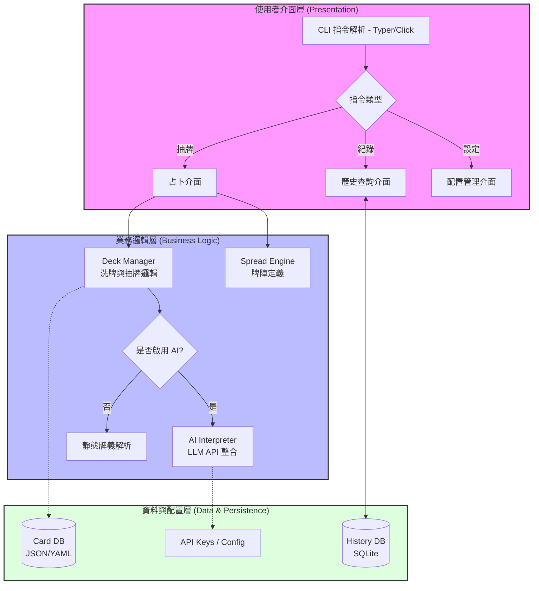

[](https://classroom.github.com/a/5PhkpLhw)
# HW2-Implementation-of-SDD-Specification-Optimization

# Taro - SDD Specification & Optimization

這是一個關於 **SDD (Software Design Description)** 規範實作與優化的專案。本專案旨在提供高效的規格定義與系統優化解決方案。

## 🚀 功能特點

* **規格實作**：精準對接 SDD 規範要求。
* **效能優化**：針對現有架構進行邏輯與資源分配優化。
* **環境隔離**：已配置 `.gitignore` 確保開發環境純淨。

## 📂 目錄結構

```text
.
├── v1/                 # 主要開發目錄 (Implementation)
├── .gitignore          # Git 忽略設定
└── README.md           # 專案說明文件
```
# 🛠️ 開始使用
## 1. 複製專案
```bash
git clone [https://github.com/catchael/Taro.git](https://github.com/catchael/Taro.git)
cd Taro
```

## 2. 建立環境
建議使用虛擬環境以避免套件衝突：
```bash
python -m venv venv
# Windows 啟動環境
.\venv\Scripts\activate
# Mac/Linux 啟動環境
source venv/bin/activate
```
## 3. 安裝依賴
```bash
pip install -r v1/requirements.txt
```

