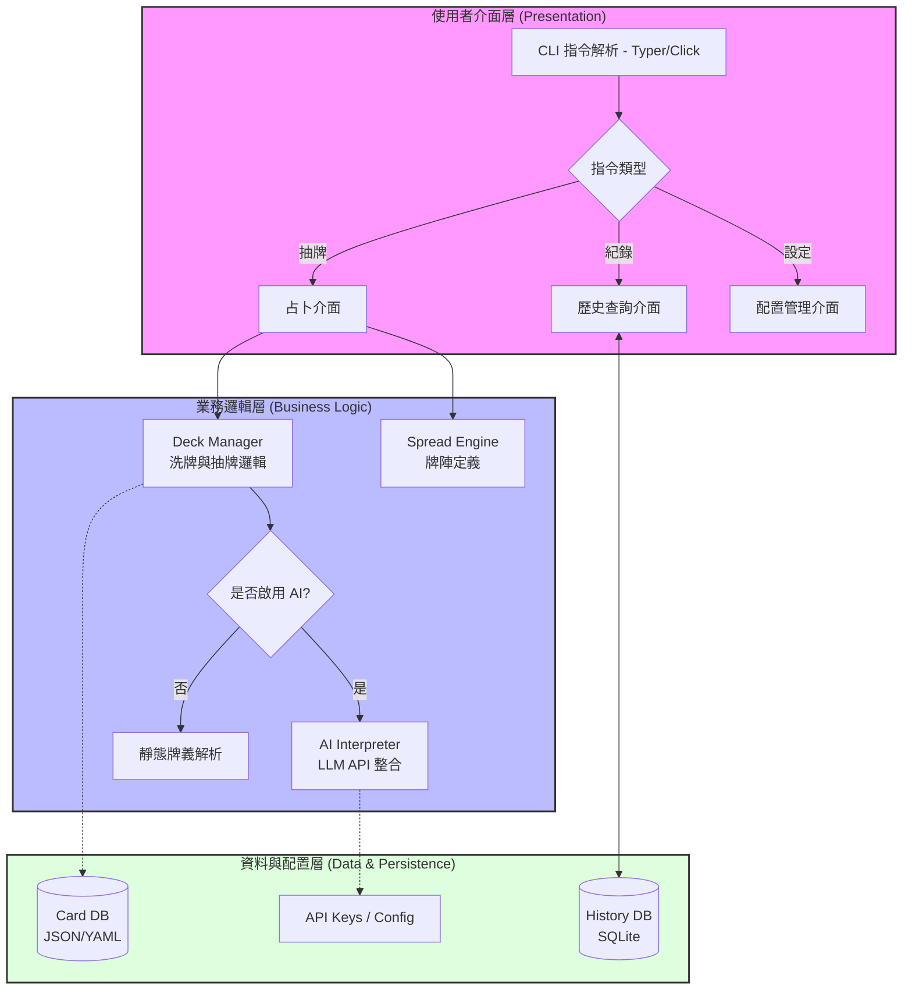

[](https://classroom.github.com/a/5PhkpLhw)
# HW2-Implementation-of-SDD-Specification-Optimization
```markdown
├── v1/
│   ├── sdd_v1.md            ← v1.0 規格文件（必要）
│   ├── main.py              ← v1.0 主程式（必要）
│   ├── requirements.txt     ← Python 套件清單（optionally）
│   └── ...                  ← 其他 v1.0 程式模組
├── v2/
│   ├── requirements_v2.md   ← 由助教 Agent 自動產生（請勿自行建立）
│   ├── sdd_v2.md            ← v2.0 規格文件（必要）
│   ├── main.py              ← v2.0 主程式（必要）
│   ├── requirements.txt     ← Python 套件清單（optionally）
│   └── ...                  ← 其他 v2.0 程式模組
└── README.md                ← 完整說明文件（必要


tarot-cli/
├── data/
│   ├── cards.json       # 完整的 78 張牌義資料
│   └── ascii_art.py     # 儲存每張牌的 ASCII 圖形
├── core/
│   ├── __init__.py
│   ├── deck.py          # 洗牌、抽牌邏輯
│   ├── spreads.py       # 牌陣定義 (三牌陣、凱爾特十字等)
│   └── ui.py           # 負責 Rich 美化渲染
├── api/
│   └── llm_client.py    # 串接 AI 解牌接口
├── database/
│   └── history.db       # 使用者紀錄
└── main.py              # CLI 入口
```


