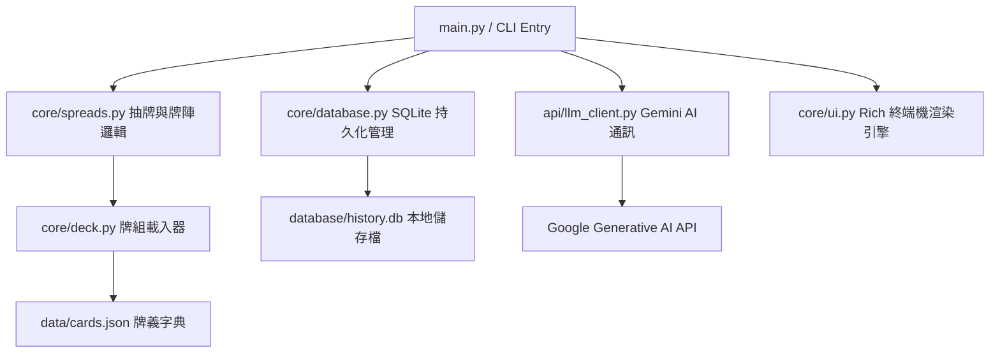

# 🔮 Tarot-CLI v1.0 SDD 文件 (Spec-Driven Development)

## 1. 專案概覽 (Project Overview)

- **程式名稱**：Tarot-CLI
- **版本**：v1.0
- **一句話描述**：一個基於終端機的塔羅占卜工具，整合本地 SQLite 紀錄與 Gemini AI 智慧解牌。
- **目標使用者**：對神祕學感興趣的開發者、需要快速心理指引的 CLI 用戶。
- **核心價值**：
    1. **隱私第一**：占卜紀錄與問題僅儲存在用戶本地設備。
    2. **互動流暢**：支援 Ctrl+V 貼上 API Key，提供自動換行且不截斷的卡片介面。
    3. **雙模運行**：支援「純文字離線模式」與「AI 連網解析模式」。

---

## 2. CLI 介面規格 (Interface Specification)

## 指令規格

### `python main.py <command> [options]`

| 指令 | 參數 | 說明 | 範例 |
|---|---|---|---|
| `draw` | `QUESTION` (Arg) | 執行占卜。系統將自動洗牌、抽牌並存檔。 | `python main.py draw "我明天的面試順利嗎？"` |
| `draw` | `--type -t` (Opt) | 指定牌陣：`single` (單牌指引) 或 `three` (三牌陣)。 | `python main.py draw "感情進展" --type three` |
| `history` | `--limit -l` (Opt) | 從資料庫調閱最近的占卜紀錄，以表格呈現。 | `python main.py history -l 10` |
| `clear` | (無) | 永久清空本地資料庫 `history.db` 中的所有紀錄。 | `python main.py clear` |
| `exit` | (無) | 顯示祝福語並安全結束程式執行。 | `python main.py exit` |

> 💡 **向下相容提示**：v2.0 將維持此介面規格。`draw` 的位置參數 `QUESTION` 與選項 `--type` 的行為已被凍結，不可刪改。

---

## 3. 資料模型 (Data Model)

### History (SQLite Table)
| 欄位 | 型別 | 說明 | 必填 |
|---|---|---|---|
| id | INTEGER | 唯一識別碼，自動遞增 PRIMARY KEY | ✅ |
| timestamp | TEXT | 占卜時間，格式為 `YYYY-MM-DD HH:MM:SS` | ✅ |
| spread_type | TEXT | 牌陣類型，儲存值為 `single` 或 `three` | ✅ |
| cards_json | TEXT | 抽中卡片的完整資料（List of Dicts），以 JSON 字串格式儲存 | ✅ |

---

## 4. 模組架構 (Module Design)

## 5. 錯誤處理規格 (Error Handling)

| 情境 | 預期行為 | 退出碼 |
|---|---|---|
| 缺少核心檔案 | 輸出 ❌ 系統初始化失敗 並停止 | 1 |
| 未傳入問題參數 | 輸出使用說明與警告 | 2 |
| API Key 錯誤 | 輸出格式警告，但允許進入非 AI 模式 | 0 |

## 6. 測試案例 (Test Cases)

| # | 輸入指令 | 預期輸出 | 通過條件 (Pass Criteria) |
|---|---|---|---|
| 1 | `python main.py` | 顯示歡迎介面、用戶須知與指令範例 | `stdout` 包含 **"🛡️ 用戶須知"** 關鍵字 |
| 2 | `python main.py draw "今日指引"` | 執行單牌占卜，顯示 1 張卡片介面 | `stdout` 包含 **"🔮"** 且 **退出碼為 0** |
| 3 | `python main.py draw "測試" -t three` | 顯示「過去、現在、未來」三個面板 | `stdout` 同時包含 **"過去"**、**"現在"** 與 **"未來"** |
| 4 | `python main.py history` | 顯示包含 Timestamp 的歷史紀錄表格 | `stdout` 包含 **"時間"** 標頭且**退出碼為 0** |
| 5 | `python main.py clear` | 顯示紅字警告，要求確認 (y/n) | `stdout` 包含 **"確定要"** 字樣 |
| 6 | `python main.py exit` | 顯示結束語並安全結束程式 | `stdout` 包含 **"願星辰"** 且 **退出碼為 0** |